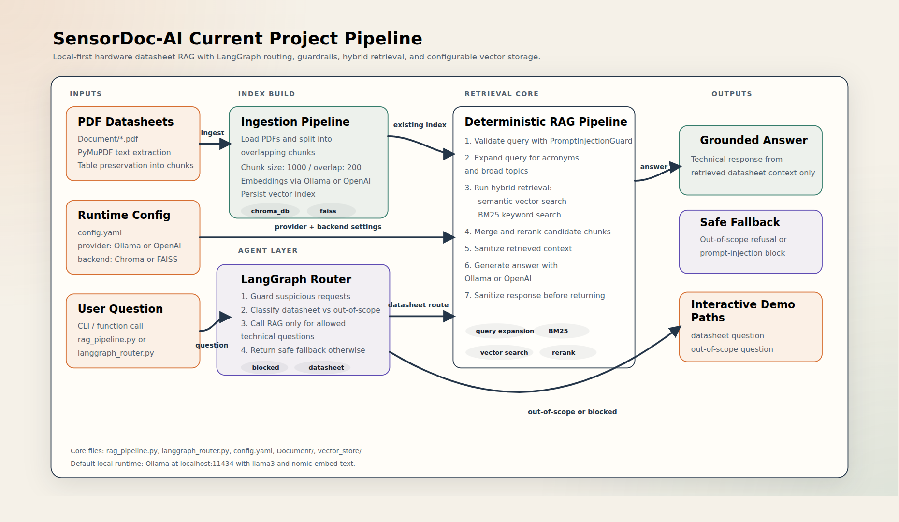

# SensorDoc-AI

SensorDoc-AI is a hardware-document RAG project for parsing sensor datasheets, preserving technical tables, and answering questions from retrieved context only.

The RAG pipeline now supports a provider switch with `ollama` as the default runtime and `openai` as an optional fallback.

## Tutorial Video

Watch the project walkthrough here:

https://youtu.be/_aEVhg6LiHE

## Features

- PDF ingestion with PyMuPDF
- Table preservation for technical datasheets
- Switchable vector store backend: ChromaDB or FAISS
- Hybrid retrieval with semantic search plus BM25
- Query expansion for broad topics and technical acronyms
- Candidate reranking to prioritize the most relevant technical chunks
- LangGraph-based agent router for guarded tool-use and intent routing
- Local-first inference with Ollama at `http://localhost:11434`
- Prompt-injection guard to block secret-exfiltration attempts and sanitize retrieved context

## Project Pipeline

The current end-to-end pipeline is illustrated below.



The editable diagram source is kept in [project_pipeline.html](project_pipeline.html).

## Requirements

- Python 3.10+
- Ollama installed locally if using the default configuration

## Setup

Create and activate a virtual environment:

```bash
python3 -m venv .venv
source .venv/bin/activate
python -m pip install --upgrade pip
pip install -r requirements.txt
```

If you want the default local model, make sure Ollama is running and the models are available:

```bash
ollama serve
ollama pull llama3
ollama pull nomic-embed-text
```

## Configuration

The default configuration in [config.yaml](config.yaml) uses Ollama:

```yaml
rag_module:
  vector_store_backend: "chroma"
  vector_store_paths:
    chroma: "./vector_store/chroma_db"
    faiss: "./vector_store/faiss_index"
  provider: "ollama"
  embedding_provider: "ollama"
  ollama:
    base_url: "http://localhost:11434"
    llm_model: "llama3"
    embedding_model: "nomic-embed-text"
```

To switch the vector database backend, change the backend in [config.yaml](config.yaml):

```yaml
rag_module:
  vector_store_backend: "faiss"
```

Recommendation:

- ChromaDB is the better default here if you want easier persistence, collection management, and future metadata filtering.
- FAISS is a good choice if you want a lightweight local vector index with minimal moving parts and fast similarity search.

To switch to OpenAI, change the providers in [config.yaml](config.yaml):

```yaml
rag_module:
  provider: "openai"
  embedding_provider: "openai"
```

Then set your API key in `.env`:

```bash
OPENAI_API_KEY=your_key_here
```

## Ingest Datasheets

Source PDFs are read from [Document](Document).

```bash
python rag_pipeline.py --ingest
```

This builds the ChromaDB store under `./vector_store/chroma_db`.

## Run Interactive Queries

```bash
python rag_pipeline.py
```

To run the LangGraph router on top of the RAG pipeline:

```bash
python langgraph_router.py
```

Example:

```python
from rag_pipeline import query_sensor_info

answer = query_sensor_info("What is the I2C address?")
print(answer)
```

LangGraph router example:

```python
from langgraph_router import agent_query

answer = agent_query("The SPI interface is only available on the MPU-6000, not the MPU-6050?")
print(answer)
```

## Prompt-Injection Protection

The pipeline includes a guardrail layer that:

- blocks suspicious user requests that try to reveal secrets, prompts, or environment variables
- removes suspicious instruction-like lines from retrieved context
- blocks responses that appear to contain API keys or secret names

This does not replace proper secret management. Keep credentials in environment variables and do not store them in PDFs or source files.

## Retrieval Strategy

The RAG pipeline uses three retrieval-hardening steps to reduce missed or incorrect answers:

- Query expansion: a user question is expanded into multiple variants such as acronym expansions, interface aliases, and summary-oriented forms.
- Hybrid search: each expanded query goes through semantic retrieval plus BM25 keyword retrieval.
- Rerank: all candidate chunks are merged, deduplicated, and reranked so exact protocol, address, and pin-level matches are prioritized before generation.

This improves two common failure modes:

- retrieval misses the right chunk because the user used a broad phrase or acronym
- retrieval returns loosely related chunks and the model answers from the wrong one

## Agent Router

The repository also includes a LangGraph-based router in [langgraph_router.py](langgraph_router.py).

It uses a bounded state graph to:

- block prompt-injection or secret-seeking requests before retrieval
- classify whether a question is likely a datasheet question or out of scope
- call the existing RAG pipeline only when the question should use datasheet retrieval
- return a safe fallback for weather, chit-chat, or unrelated requests

This keeps tool-use explicit and avoids free-form looping. The graph has fixed nodes and no unbounded recursive retry path.

## Reasoning Pipeline

The repository can also be extended into an explainable-diagnostics workflow: use a predictive model such as XGBoost to detect anomalies or failures, then use RAG to explain the prediction in hardware-engineering language.

This is best understood as **XAI via RAG**:

- XGBoost provides the prediction result and the most influential features.
- SHAP or LIME extracts feature-level attribution for a specific prediction.
- A data-to-text layer converts structured features into semantic descriptions.
- The semantic description becomes the retrieval query for datasheets, specs, and failure-mode references.
- The LLM compares model evidence with retrieved hardware constraints and produces an actionable diagnostic report.

### Recommended Flow

1. Predict with XGBoost.
2. Extract top contributing features with SHAP or LIME.
3. Serialize the structured feature signals into descriptive text.
4. Use that text as the search query for the RAG system.
5. Retrieve the relevant datasheet sections, thresholds, interfaces, and failure notes.
6. Generate a final reasoning report that combines prediction evidence with retrieved hardware knowledge.

### Why This Matters

XGBoost alone can tell you **what** the model predicted, but not always **why that result matters in the hardware domain**.

RAG fills that gap by grounding the model's important features against documentation such as:

- sensor operating limits
- noise thresholds
- package constraints
- interface tolerances
- known failure modes from datasheets or engineering notes

This turns a black-box output into a report that is more useful for hardware engineers.

### Example Data-to-Text Conversion

Structured prediction output:

```json
{
  "prediction": "Sensor Failure",
  "top_feature": "acc_z_std",
  "feature_value": 0.05,
  "baseline": 0.02
}
```

Semantic description used for retrieval:

```text
The model predicted Sensor Failure because the standard deviation of the Z-axis accelerometer reached 0.05g, which is above the normal baseline of 0.02g.
```

Possible retrieval query derived from that description:

```text
Z-axis accelerometer noise threshold sensor failure modes package damage solder crack
```

### Final Reasoning Output

The final report can combine:

- prediction result from XGBoost
- local explanation from SHAP or LIME
- retrieved datasheet evidence from the RAG system

Example report:

```text
The system classified this unit as Sensor Failure. The dominant factor is abnormal Z-axis noise at 0.05g. Retrieved hardware documentation indicates that this level exceeds the expected tolerance band and may correlate with package stress or solder-joint degradation. Recommended follow-up inspection: verify Z-axis signal integrity and inspect the relevant package pins and solder connections.
```

### Suggested Implementation Surface

For this repository, the clean extension path is:

- keep `rag_pipeline.py` as the retrieval and grounded-generation layer
- keep `langgraph_router.py` as the routing and guardrail layer
- use `reasoning_pipeline.py` as the prototype reasoning bridge that:
  - accepts prediction output from XGBoost
  - serializes SHAP or LIME style evidence into text
  - builds a retrieval-oriented query from structured evidence
  - helps `rag_pipeline.py` produce a grounded explanation report

This design keeps prediction, explanation, retrieval, and final reasoning loosely coupled and easier to debug.

Example usage:

```python
from rag_pipeline import query_sensor_info

prediction_payload = {
  "model_type": "XGBoost",
    "prediction": "Sensor Failure",
  "predicted_label": "Sensor Failure",
  "confidence": 0.91,
  "top_feature": "acc_z_std",
  "feature_value": 0.05,
  "baseline": 0.02,
  "shap_attributions": [
    {
      "feature": "acc_z_std",
      "contribution": 0.41,
      "value": 0.05,
      "baseline": 0.02,
      "unit": "g",
    },
    {
      "feature": "temp_drift",
      "contribution": 0.12,
      "value": 3.6,
      "unit": "C",
    },
  ],
}

answer = query_sensor_info(
    "What hardware issue could explain this failure?",
    prediction_payload=prediction_payload,
)
print(answer)
```

### Standard SHAP Payload Schema

The canonical payload shape for the reasoning bridge is:

```json
{
  "model_type": "XGBoost",
  "prediction": "Sensor Failure",
  "predicted_label": "Sensor Failure",
  "confidence": 0.91,
  "top_feature": "acc_z_std",
  "feature_value": 0.05,
  "baseline": 0.02,
  "shap_attributions": [
    {
      "feature": "acc_z_std",
      "contribution": 0.41,
      "value": 0.05,
      "baseline": 0.02,
      "unit": "g"
    }
  ],
  "raw_signal": {
    "sensor_id": "imu-7",
    "sample_window_ms": 500
  }
}
```

Notes:

- `shap_attributions` is the preferred normalized field.
- Older shapes like `shap_values: {feature: contribution}` are still accepted and normalized internally.
- `feature_contributions` is also accepted as a fallback alias.
- `lime_explanation` can be supplied alongside SHAP data when available.

## Secret Management

- Never commit API keys to Git or upload them to GitHub.
- Use a `.env` file with `python-dotenv` for local development.
- In cloud environments such as AWS, Azure, or GCP, use a managed secret store like Secrets Manager or Key Vault.
- In CI/CD systems such as GitHub Actions or Jenkins, use built-in secret variables instead of hardcoding credentials.

## Notes

- If you use `openai`, `OPENAI_API_KEY` is required.
- If you use `ollama`, the project works without an OpenAI key.
- BM25 is rebuilt from the source PDFs when loading an existing vector store.

## Evaluation

The repository includes a formal 25-sample benchmark in [eval_dataset.jsonl](eval_dataset.jsonl), a formal policy in [eval_policy.json](eval_policy.json), a batch runner in [eval_runner.py](eval_runner.py), and a Markdown report generator in [eval_report.py](eval_report.py).

Run the baseline eval pass:

```bash
python eval_runner.py
```

Run the eval pass with LLM-as-a-judge scoring:

```bash
python eval_runner.py --judge
```

Generate a readable Markdown report from JSONL results:

```bash
python eval_report.py --results eval_results.jsonl --output eval_report.md
```

The judge rubric is defined in [llm_judge_prompt.md](llm_judge_prompt.md) and is specialized for this project's two use cases:

- datasheet-grounded technical QA
- XAI via RAG, where model evidence must support retrieval but must not be treated as proof without datasheet backing

The pass/fail policy is formalized in [eval_policy.json](eval_policy.json):

- heuristic gates: expected-fact hit rate, must-include hit rate, forbidden-term violations
- category-specific judge thresholds for datasheet QA, XAI via RAG, and safety
- category-specific heuristic overrides to avoid false failures on refusal-style and judge-approved answers
- an overall score threshold per category
- `incomplete` status when final policy judgment is requested but no LLM judge result is present

The generated [eval_report.md](eval_report.md) is designed to be PR-ready and includes:

- release summary
- category trends
- fail matrix
- recommended fixes
- failed sample drill-downs

Each JSONL row can include:

- `question`
- `prediction_payload`
- `expected_answer`
- `expected_facts`
- `must_include`
- `must_not_include`
- `judge_focus`

## Prediction Diagnosis API

For practical failure analysis, use the dedicated `query_prediction_diagnosis(...)` API instead of the plain datasheet QA path.

This diagnosis API is different in three ways:

- Input shape: it accepts `sensor_data_summary`, `xgboost_output`, and `user_query`
- Retrieval priority: it searches internal FA reports, engineering rules, and notes before generic datasheet chunks
- Prompt contract: it uses a stricter failure-analysis prompt with explicit sections for observation, specification conflict, hypothesis, and recommended action

Example:

```python
from rag_pipeline import query_prediction_diagnosis

answer = query_prediction_diagnosis(
  sensor_data_summary="Z-axis noise 0.05g, Temp 40C, repeated I2C retries",
  xgboost_output={
    "label": "Failure",
    "prediction": "Failure",
    "top_feature": "acc_z_std",
    "confidence": 0.92,
  },
  user_query="What is the likely diagnosis and what should the engineer check next?",
)
print(answer)
```

### Internal Knowledge Sources

The diagnosis pipeline can ingest non-public knowledge from [InternalKnowledge](InternalKnowledge):

- FA reports
- engineering rules
- troubleshooting notes

Supported internal file types are Markdown and text files. After adding or updating these files, rebuild the store:

```bash
python rag_pipeline.py --ingest
```

This lets future employees add rules such as UART limitations or archived FA observations without editing Python code.